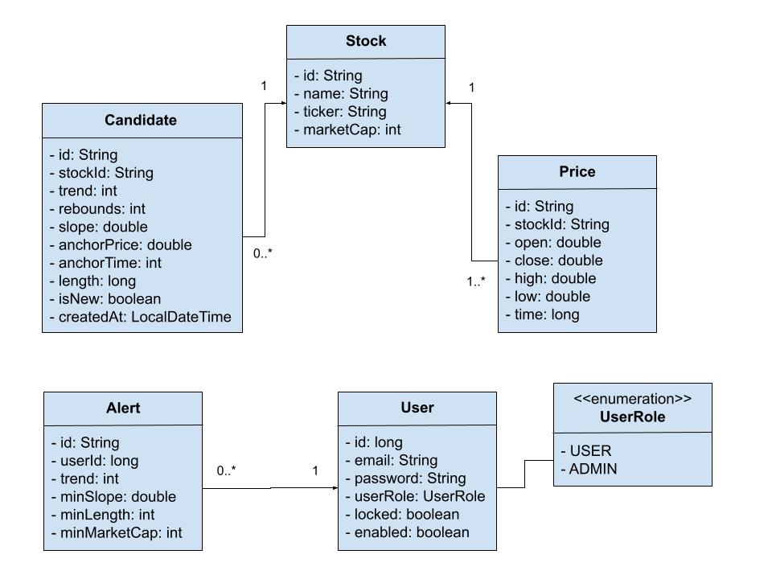

# Trade Alert

Site is live at [tradealert.money](https://tradealert.money/). (no longer live)

Email service and accompanying web application for sending customizable weekly email alerts of stocks that have recently reached a price around a proven support line.

Users can receive weekly email alerts that contain a list of stocks that hit their support line that week. Email alerts can be configured to only include stocks that meet customizable minimum growth, pattern length, and market cap thresholds. Support stocks are added and removed from the web application daily based on their prices provided by the [FinnHub API](https://finnhub.io/).

- Java Spring REST service fetches stock price data from [FinnHub](https://finnhub.io/) and analyzes if a stock's price is at a support line that has been tested multiple times.
- React web application that renders the list of stocks and allows logged in users to create and delete email alert triggers.
- PostgreSQL database for storing stocks, prices, alerts, and users.
- AWS Simple Email Service for sending customizable weekly email alerts of stocks that recently reached their support line.
- Hosted on AWS ElasticBeanstalk (EBS), Simple Cloud Storage (S3), and Relational Database Service (RDS).

